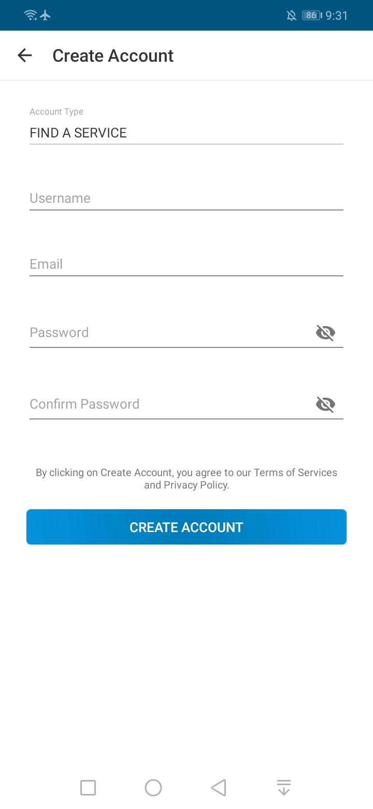
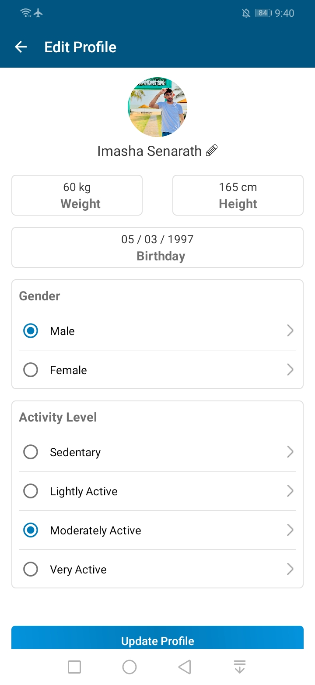

<h1> iFit Coach</h1>

A Fitness Tracker App, built with Java and Firebase, connects users with fitness community, professionals and resources for a healthier lifestyle. It also offers fitness tracking, nutrition plans, and more to enhance health and fitness.

Note: This app was developed as a university final-year individual project.

<h2> ⚙️ Technologies </h2>
<ul>
    <li>Java language for Android development.</li>
    <li>Firebase backend service including Authentication, Database and Storage.</li>
    <li>UI design with XML.</li>
    <li>Third party libabries.</li>
</ul>

<h2> 🔥 Features </h2>
<ul>
    <li>Monitor daily calorie consumption and calories burning.</li>
    <li>Track daily water intake.</li>
    <li>Maintain a diary with daily food, water, and workouts with past records.</li>
    <li>Find detailed nutritional data information various foods.</li>
    <li>Calculate daily calorie intake, BMI, and other metrics based on the profile.</li>
    <li>Set a weight loss goals and earn points by achieving them.</li>
    <li>Engage with the community by sharing posts, commenting, and messaging other users.</li>
    <li>Connect with others users and view their profiles, diaries, posts, and build connections.</li>
    <li>Professionals can sell services by registering as a seller.</li>
    <li>Discover professionals, get services, and rate experiences with others.</li>
</ul>

<h2>🛢️ Set Up Database</h2>

This project uses Firebase, but the current Firebase account has been disabled due to spamming, so the app won’t work. To make it functional, create a new Firebase project, add the Android app, and generate the google-services.json file. Place it in the app/ directory. Then, enable Email Authentication, Realtime Database, and Cloud Storage in your Firebase project.

  
<h2> 📸 Screenshots </h2>

  
 
 
 
  
  
  
 
 
 
 

To see all screenshots, check the "ss" folder.

<h2> 👽 Author </h2>
<a href="https://www.imashasenarath.com/" target="_blank"><strong>Imasha Senarath</strong></a>

<h2> © Credits </h2>

All icons, images, and other media used in this project are the property of their respective copyright owners. Their rights are fully acknowledged and respected.
